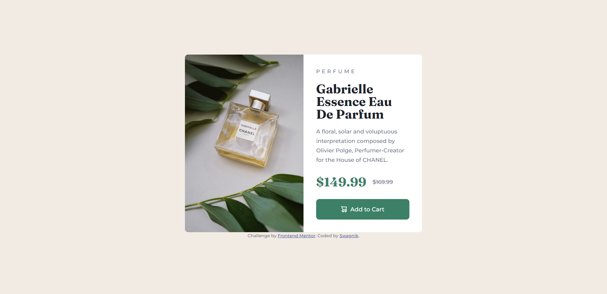
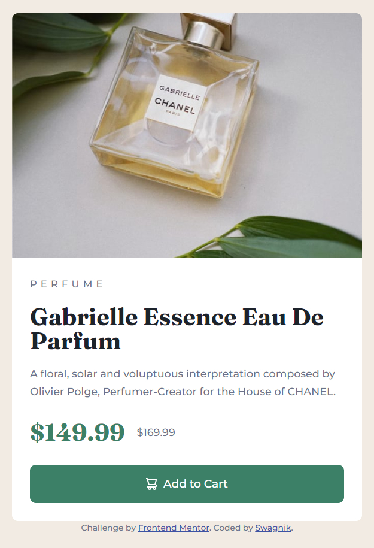

# Frontend Mentor - Product preview card component

## Table of contents

- [Overview](#overview)
  - [The challenge](#the-challenge)
  - [Screenshot](#screenshot)
  -[Links](#links)
- [My process](#my-process)
  - [Built with](#built-with)
  - [What I learned](#what-i-learned)
  - [Useful resources](#useful-resources)
- [Author](#author)
- [Acknowledgments](#acknowledgments)

## Overview
This is a solution to the [Product preview card component](https://www.frontendmentor.io/challenges/product-preview-card-component-GO7UmttRfa). It is a very beginner to intermediate friendly and drilling challenge,html and css works. 

### The challenge

Users should be able to:

- View the optimal layout depending on their device's screen size
- See hover and focus states for interactive elements

### Screenshot

Desktop view ss-

Mobile view ss-

### Links

- Solution URL: [click here](https://github.com/swagthehooman/Product-preview-component)
- Live Site URL: [click here](https://swagthehooman.github.io/Product-preview-component/)

## My process

The design looks easy enough for implementation, but it becomes really difficult when the whole layout has to change when device size changes.  I took help from Kevin Powell's solution on youtube. The link to that video is in provided.

### Built with

I used custom css and html 5 for this challenge.
- Semantic HTML5 markup
- CSS custom properties
- Flexbox
- CSS Grid
- Mobile-first workflow

### What I learned

So many things I learned with this challenge.
- use of flex box
- custom button styling
- centering divs
- hover and focus effects
- media query for changing card layouts
- picture tags

### Useful resources

-[YouTube](https://youtu.be/B2WL6KkqhLQ)

## Author

- LinkedIn [Swagnik Das](https://www.linkedin.com/in/swagnikdas/)
- GitHub [swagthehooman](https://github.com/swagthehooman)
- Frontend Mentor [Swagnik Das](https://www.frontendmentor.io/profile/swagthehooman)

## Acknowlegment

I'd like to thank my friends for their support and helping hand in completion of this challenge.
